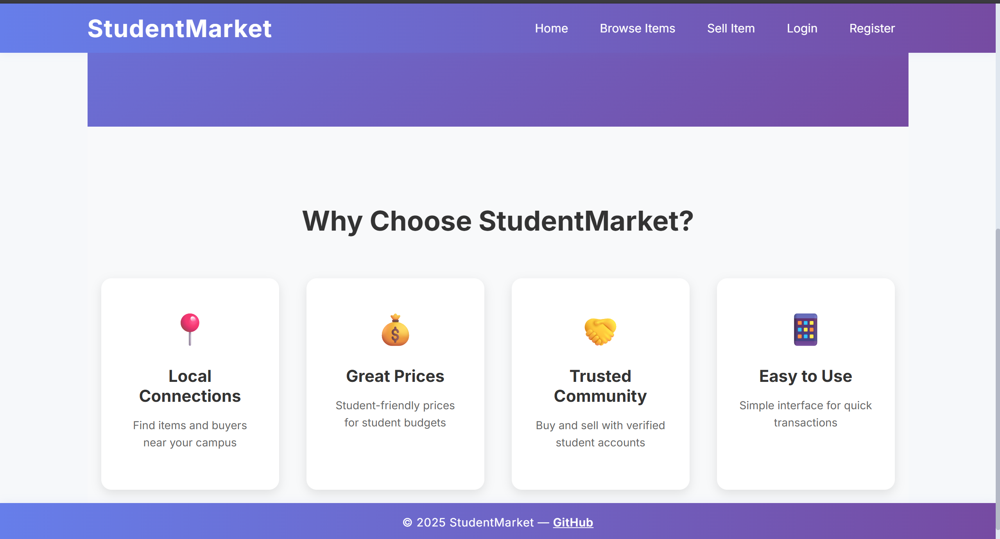

# UniTrade



A modern, full-stack peer-to-peer marketplace for students to buy and sell used items (books, clothes, electronics, and more) with others around their campus.

## Features

- Student registration and login
- List items for sale with images, price, category, location, and WhatsApp contact
- Browse and search items by category and price
- Contact sellers directly via WhatsApp for true peer-to-peer transactions
- Modern, responsive UI/UX for desktop and mobile
- Secure password storage and user authentication

## Tech Stack

- **Frontend:** React, CSS
- **Backend:** Node.js, Express
- **Database:** MongoDB (Atlas-ready)
- **Image Uploads:** Local (easy to switch to cloud storage)

## Getting Started

### Prerequisites

- Node.js & npm
- MongoDB (local or [MongoDB Atlas](https://www.mongodb.com/cloud/atlas))
- Git

### Installation

1. **Clone the repository:**
   ```sh
   git clone https://github.com/rishabhsawjann/UniTrade.git
   cd UniTrade
   ```

2. **Backend setup:**
   ```sh
   cd backend
   npm install
   # Create a config.env file with your MongoDB URI and JWT secret
   npm run dev
   ```

3. **Frontend setup:**
   ```sh
   cd ../frontend
   npm install
   npm start
   ```

4. **Visit:**  
   - Frontend: [http://localhost:3000](http://localhost:3000)  
   - Backend: [http://localhost:5000](http://localhost:5000)

## Deployment

- Deploy backend to [Render](https://render.com/) or [Heroku](https://heroku.com/)
- Deploy frontend to [Vercel](https://vercel.com/) or [Netlify](https://netlify.com/)
- Use [MongoDB Atlas](https://www.mongodb.com/cloud/atlas) for cloud database

## License

This project is licensed under the MIT License. 